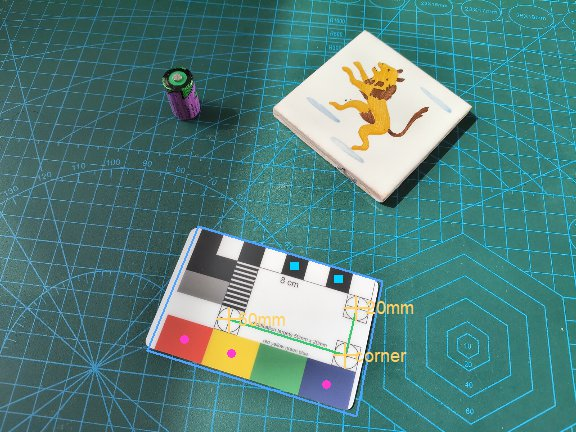
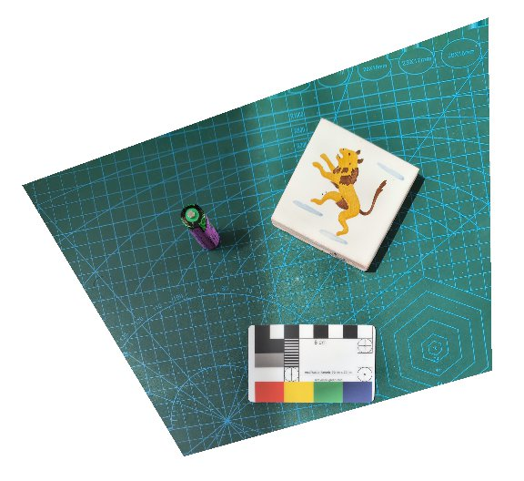

<!-- README.md is generated from README.Rmd — edit README.Rmd, then run
     rmarkdown::render("README.Rmd") (needs pandoc). -->

# scalecard

`scalecard` perspective-corrects (“rectifies”) and scales photographs
taken with the **Credit Card Photography Scale** (Past Horizons)
calibration card. The card’s three crosshair rectification targets (on a
precise 50 × 20 mm frame), its red/yellow/blue colour patches and its
8 cm scale-bar squares are detected automatically and used as
ground-control points for a projective (homography) transform. The
result is a flat image at a known pixels-per-millimetre scale, so any
feature can be measured in millimetres. It is an R port of a browser
(OpenCV.js) tool, built on `magick`, `imager` and `EBImage`.

## Installation

``` r
# needs: magick, imager, and EBImage (Bioconductor)
# install.packages(c("magick", "imager"))
# install.packages("BiocManager"); BiocManager::install("EBImage")

# install.packages("remotes")
remotes::install_github("daliakopoulos/scalecard")
```

## A worked example

The package ships with a sample photo (a calibration card and two
objects on a cutting mat). Load it and run the whole pipeline in one
call.

``` r
library(scalecard)
img <- system.file("extdata", "sample.jpg", package = "scalecard")
```

### Detection

`detect_card()` finds the card and all its control points automatically.

``` r
det <- detect_card(img)
#> Card found in 1600 x 1200 px image (~6.97 px/mm).
#>   3 crosshairs + 3 colour patches + 2 bar squares = 8 control points.
#>   swatches measured: red, yellow, blue, white, black
det
#> <scalecard detection>
#>   image      : 1600 x 1200 px
#>   scale      : ~6.97 px/mm
#>   crosshairs : 3  (corner / horiz / vert)
#>   patches    : 3  bar squares: 2
#>   swatches   : 5 / 6 measured
#>   control pts: 8  (perspective fit)
```

The overlay shows the detected geometry: the blue outline follows the
card’s true perspective skew, the green “L” is the 50 × 20 mm target
frame, yellow crosses the three crosshair targets, magenta dots the
colour patches and cyan squares the 8 cm bar squares.

``` r
plot(det, image = img)
```



### Rectification

`rectify_card()` builds a homography from all the control points and
warps the photo flat at a chosen resolution (default 10 px/mm). It
white-balances off the card, keeps the full scene (never cropped), and
fills anything outside the original frame with white instead of smeared
edges.

``` r
rec <- rectify_card(img, grid = FALSE)
#> Card found in 1600 x 1200 px image (~6.97 px/mm).
#>   3 crosshairs + 3 colour patches + 2 bar squares = 8 control points.
#>   swatches measured: red, yellow, blue, white, black
#> Rectified: 3280 x 3040 px, 10 px/mm (0.1000 mm/px), perspective from 8 points.
#>   registration RMS error: 0.195 mm
rec
#> <scalecard rectified>
#>   output  : 3280 x 3040 px
#>   scale   : 10 px/mm (0.1000 mm/px)
#>   fit     : perspective from 8 control points
#>   RMS err : 0.195 mm
```

``` r
show_img(rec$image)
```



### Measuring

The output has a known scale, so a pixel distance converts straight to
millimetres:

``` r
rec$px_per_mm            # pixels per mm
#> [1] 10
measure_mm(rec, 250)     # 250 px on the rectified image, in mm
#> [1] 25
```

## It rectifies ONE plane

The card fixes a single plane (the surface it lies on). **Flat** objects
on that surface rectify to their true size and shape anywhere in the
frame. Objects with **height** (3-D shapes) distort by parallax, which a
single photo cannot correct. The farther from the card and the steeper
the camera angle, the more the surrounding plane is stretched when
flattened.

**For best results:** lay the card flat *in the same plane* as the
objects and close to them, keep objects flat, and shoot as square-on
(top-down) as you can with the whole working area in frame.

## When auto-detection fails

For difficult photos (poor lighting, busy background, tiny card) use the
interactive fallback `manual_targets("photo.jpg")`: a native window
opens and you click the three crosshair targets; a matched filter snaps
each click to the ring centre. The result is passed to `rectify_card()`
via its `detection` argument.

## Function reference

| function           | purpose                                             |
|--------------------|-----------------------------------------------------|
| `rectify_card()`   | detect + rectify + (optional) colour fix + grid     |
| `detect_card()`    | automatic detection of all ground-control points    |
| `manual_targets()` | interactive click-based fallback for the crosshairs |
| `white_balance()`  | gray-world white balance off the card               |
| `color_correct()`  | colour transform to the card’s reference swatches   |
| `measure_mm()`     | convert a pixel distance to mm                      |
| `card_spec()`      | the fixed card geometry (edit if your card differs) |

A fuller walkthrough is in the package vignette:
`vignette("scalecard")`.

## License

MIT © Ioannis Daliakopoulos
